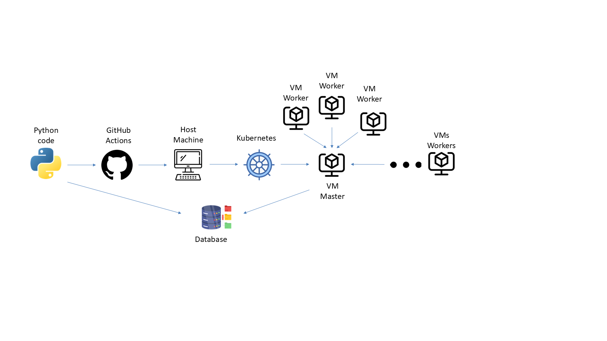

<h1 align="center">K3s-aaS</h1>



# Setup Github Actions use your kubernetes

First open Github in browser 

Go settings (inside repo) -> Secrets and Variables -> Actions and create a New repository secret and add the file kube-config

Also, to run on your machine we will have to activate the self host :

Go settings (inside repo) -> Runners -> Create self-hosted runner and follow the instractions in your pc

# Github Actions files (Vm master and Vm worker)

## Overview

Go to section Action and create New workflows. One for the master and one for the agent.

Inside `.github/workflows/`, there are two GitHub Actions workflows:

1. Deploy VMs Master - Responsible for deploying the master node.

2. Deploy VMs Agent - Responsible for deploying the agent (worker) node.

These workflows automate the provisioning and configuration of virtual machines using OpenTofu and Terraform-like infrastructure as code.

## Deploy VMs Master Workflow

### Purpose
This workflow sets up and provisions the master VM, initializes OpenTofu, and applies the configuration to create the Kubernetes master node.

### Trigger
- Manual trigger using `workflow_dispatch`, requiring a variables file input (default: `main.tf`).

### Steps
1. Checkout Repositories
   - Clones the current repository.
   - Clones the K3s-aaS repository where the master configuration files exist.
2. View Master Directory
   - Lists the contents of the master directory inside K3s-aaS.
3. Install Dependencies
   - Installs OpenTofu (Terraform alternative).
     
4. Set Up Kubernetes Credentials
   - Configures Kubernetes access using a secret-stored `KUBE_CONFIG`.
5. Check OpenTofu Files
   - Displays the contents of relevant directories.
6. Initialize OpenTofu
   - Runs `tofu init` in the master directory.
7. Apply OpenTofu Configuration
   - Runs `tofu plan` to preview changes.
   - Runs `tofu apply` to provision the master VM and set up Kubernetes.
8. Extract Master VM Info
   - Master node IP (`k3s_master_ip`)
   - Kubernetes join token (`k3s_token`)
   - Kubeconfig file path (`kubeconfig_file`)
9. Upload Outputs as Artifacts
    - Stores the extracted information (`master-outputs.env`, `kubeconfig.env`) as artifacts.

## Deploy VMs Agent Workflow

### Purpose
This workflow sets up the worker node by retrieving the master node details and using them to join the cluster.

### Trigger
- Manual trigger using `workflow_dispatch`, requiring a variables file input (default: `main.tf`).

### Steps
1. Checkout Repositories
  - Clones the current repository.
  - Clones the `K3s-aaS` repository where the worker configuration files exist.
2. View Worker Directory
  - Lists the contents of the worker directory inside `K3s-aaS`.
3. Set Up Kubernetes Credentials
  - Configures Kubernetes access using a secret-stored `KUBE_CONFIG`.
4. Retrieve Master VM Information
    - Finds the latest run ID of the `Deploy VMs Master` workflow.
    - Downloads the `master-outputs` artifact containing master node details
    - Extracts the following:
      - `MASTER_IP`
      - `K3S_TOKEN`
5. Verify Master Node Data
    - Displays extracted values to confirm successful retrieval.
6. Initialize OpenTofu
  - Runs tofu init in the worker directory.
7. Validate OpenTofu Configuration
  - Runs tofu `validate` to ensure configuration correctness.
8. Apply OpenTofu Configuration
  - Runs `tofu plan` with variables:
      - `namespace`: Dynamic cluster namespace
      - `master_ip`: Master node IP
      - `k3s_token`: Token for joining the cluster
  - Runs `tofu apply` to provision the worker VM and join it to the cluster

## Summary
These workflows automate the provisioning of Kubernetes nodes using OpenTofu and allow seamless scaling of the cluster. The Deploy VMs Master workflow must be executed before Deploy VMs Agent to ensure the master node details are available for worker node configuration.

# Terraform files (Vm master and Vm worker)

## Master Terraform file
Inside `./master/`, there are two files:
1. `main.tf`: Terraform script creates a virtual machine (VM) in KubeVirt
2. `find_free_nodeport.sh`: Bash script is responsible for finding and returning an available NodePort in a Kubernetes cluster

### `main.tf`
This Terraform script creates a virtual machine (VM) in KubeVirt, configuring it as a master node for a K3s cluster, and configures the environment so that you can connect to the VM and join it to the Kubernetes cluster.

The script does the following steps:
   1. Create namespace: creates the namespace in Kubernetes where the resources will be deployed.
   2. Create the VM in KubeVirt: Creates a VM running Ubuntu and configures the VM with a cloud-init file to configure it.
   3. Preparing the VM: The VM is configured by installing K3s, Helm and Nerdctl.
   4. VM IP discovery and extraction: extracts the IP of the VM after it is placed in the K3s cluster.
   5. Download the K3s token and kubeconfig: Retrieve the K3s token and kubeconfig from the master node so you can connect to the cluster.
   6. Create a Kubernetes Service: creates a NodePort type service that allows access to the VM via SSH.

Detailed Explanation of the Script:
   - `terraform` block: specifies the required provider version for KubeVirt.
   - `variable "namespace"`: specifies the namespace to be used for resource deployment.
   - Provider `kubevirt`: configures the KubeVirt provider to interact with the KubeVirt API.
   - `resource "kubernetes_namespace"`: creates a namespace in Kubernetes.
   - `data "kubernetes_secret" "existing_secret"`: reads the existing Kubernetes secret containing the SSH key to access the VM.
   - `locals { ssh_key = ... }`: Sets the SSH key that will be used in the VM's cloud-init.
   - `resource "kubevirt_virtual_machine" "github-action-master"`: creates the VM using the Ubuntu image, with configuration including connecting to Kubernetes          and installing K3s.
   - Cloud-init script: the cloud-init file includes the automated installation of tools such as `nerdctl`, `k3s` and `helm`, as well as configuring the user for         SSH access.
   - `data "external" "free_node_port"`: runs a script to find an available NodePort port on Kubernetes to run the SSH service.
   - `resource "kubernetes_service" "github_nodeport_service"`: creates a NodePort service to connect to the VM via SSH.
   - `data "external" "k3s_master_ip"`: waits for the IP of the VM and extracts it from Kubernetes.
   - `data "external" "k3s_token"`: receives the K3s token from the master node via SSH.
   - `data "external" "k3s_kubeconfig"`: exports the kubeconfig from the master node to use it to connect to the K3s cluster.
   - Outputs: provides the K3s token, the IP of the master node, and kubeconfig so you can connect and manage the cluster.

#### Create an SSH key pair
Using the `ssh-keygen -t ed25519` command, we generate a key pair with the Ed25519 algorithm, which is more secure and efficient than the RSA algorithm.
Procedure:
   1. You will be asked to enter a name and location for the key (default: `~/.ssh/id_ed25519`).
   2. You can set a password (passphrase) for increased security or press Enter to not set a password.
      
### `find_free_nodeport.sh`
This Bash script is responsible for finding and returning an available `NodePort` in a Kubernetes cluster. A `NodePort` is a port exposed to Kubernetes nodes so that you can access Kubernetes services from the outside.

1. Set port boundaries:
  - `MIN_PORT=30000` and `MAX_PORT=32767`: Sets the limits for the available NodePort ports to be used (from 30000 to 32767, which is the range for NodePort ports      in Kubernetes).
2. Finding occupied doors:
   - The `kubectl get services --all-namespaces -o=jsonpath='{.items[*].spec.ports[*].nodePort}'` command gets all services from the Kubernetes cluster and             extracts all used NodePort ports.
   - Stores the occupied ports in the `USED_PORTS` variable.
3. Check for available port:
   - The script checks for the first available port in the range from 30000 to 32767 that is not already in use by other Kubernetes services.
   - If an available port is found, it returns it in JSON format: `{"output":"<port>"}`.
4. If no port is found available:
   - If no port is available in the range, the script prints an error message and returns an output code of `1`, indicating that no port was found.

##  Worker Terraform file

Inside `./worker/`, there is one file:
1. `main.tf`: This Terraform script creates and configures a KubeVirt Virtual Machine that will act as a K3s Agent Node.

### `main.tf`

This Terraform file is designed to create and configure a KubeVirt Virtual Machine (VM) to be used as a K3s Agent Node in a Kubernetes cluster. It uses Terraform with the KubeVirt provider to create and configure the virtual machine.

 The script includes the following steps:

 1. Set Parameters:
    - `namespace`: specifies the namespace in which the resources will be deployed.
    - `master_ip`: The IP address of the K3s master node.
    - `k3s_token`: The token of the K3s master node to authenticate the agent.
    - `namespace_master`: The namespace of the master node in Kubernetes.
2. Provider Configuration:
   - Two providers are defined:
        - Kubernetes: uses the `~/.kube/config` file to connect to the Kubernetes cluster.
        - KubeVirt: Sets the KubeVirt provider to interact with the KubeVirt infrastructure.
3. Create Virtual Machine (VM):
   - `kubevirt_virtual_machine`: creates a new virtual machine named `github-action-agent-${var.namespace}` and places it in the namespace specified by the       
     `namespace_master` parameter.
4. Template and VM Configuration:
   - The virtual machine has two disks:
        - rootdisk: installs the Ubuntu operating system from a cloud image URL.
        - cloudinitdisk: configures the virtual machine via Cloud-init, which installs the K3s Agent Node and connects it to the K3s master node.
5. Cloud-init Configuration (Cloud-init Config Drive):
   - Cloud-init:
        - creates the `apel`user with `sudo` privileges.
        - Downloads and executes the K3s agent setup script, which configures the agent node to integrate with the K3s cluster.
6. Setting up systemd Service:
   - It creates a `systemd` service named `k3s-agent-setup.service`, which runs the K3s agent installation script when the virtual machine starts.
7. Execute Commands:
   - It executes commands to load the new service, activate it and start it, thus allowing automatic configuration of the K3s agent once the virtual machine is          started.

# Python code for run Workflows

First create Github token. Used for authentication in the GitHub API.
Go profile -> settings -> Developer settings -> Personal access tokens (PAT) -> Token (classic)  -> Generate new token(classic)
If the repository exists in an organization, follow these instructions.
Go profile -> settings -> Developer settings -> Personal access tokens (PAT) -> Token (classic)  -> Generate new token(classic)

Inside `python-code/`: there are three Python scripts:

1. `action-github.py`: Script related to automated actions on GitHub, for managing workflows and communicating with APIs.
2. `export_kubeconfig.py`: Script to export the kubeconfig file and run helm using ths file.
3. `upload.py`:  Script automates the process of retrieving information from a GitHub Actions workflow, and storing it in a database.
   

## `action-github.py`
The `action-github.py` is a script that automates the process of starting GitHub Actions workflows for deploying virtual machines (VMs) and installing a K3s cluster.

Function of the script
1. Deployment of Master & Worker VMs
   - The GitHub Actions workflow for deploying the Master VM starts.
   - Repeats the process for the number of Worker VMs specified by the user.
   - Checks if workflows were successfully completed.
2. Configuration of the K3s Cluster
   After the VM nodes are deployed:
     - Runs `upload.py` to upload the necessary data to a database.
     - Runs `export_kubeconfig.py` to export kubeconfig.
3. Error management & logging
   - If a workflow fails, the script is terminated with an error message.
   - Supports manual termination with `Ctrl + C`.
   - Logs all events to `workflow_runner.log`.

## `export_kubeconfig.py`
The `export_kubeconfig.py` is a script that retrieves and configures the kubeconfig of a K3s cluster created via GitHub Actions.

Function of the script
1. Recovery of the Last Workflow Run
   - It connects to the GitHub Actions API and looks for the last successful run of the "Deploy VMs Master" workflow.
   - If it does not find a relevant run, it terminates the process.
2. Download and Decompression of Artifacts
   - Downloads the workflow artifacts, which contain:
       - The `master-outputs.env` file containing the IP address of the Master Node.
       - The `kubeconfig.env`, which contains kubeconfig in encoded form (Base64).
  - It decompresses the files and extracts the necessary data.
3. Configuration of Kubeconfig
  - Decodes `kubeconfig` and saves the `kubeconfig_<run_id>.yaml` file.
  - Replaces the `server: https://127.0.0.1:6443` with the IP address of the Master Node.
  - Adds the `insecure-skip-tls-verify: true` option to allow connections without certificate verification.
  - Removes `certificate-authority-data` to prevent certificate errors.
4. Automatic Helm Chart Installation
  - Prompts the user to enter the Helm Repository, Helm Chart and Release Name.
  - Execute the following Helm commands to install the application on the K3s cluster:
      - ```bash
        helm repo add <repo_name> <repo_url> --kubeconfig kubeconfig_<run_id>.yaml
        helm repo update --kubeconfig kubeconfig_<run_id>.yaml
        helm install <release_name> <chart_name> --kubeconfig kubeconfig_<run_id>.yaml
        ```
  - If the installation fails, it displays an appropriate error message.

## `upload.py`
This script is written in Python and automates the process of retrieving information from a GitHub Actions workflow, and storing it in a database.

Function of the script
1. Retrieve the last run ID
  - Calls the GitHub API to find the most recent execution ID of the "Deploy VMs Master" workflow in the `APELGroup/K3s-aaS` repository.
2. Downloading and decoding files from GitHub Actions
  - Finds the appropriate artifact (`master-outputs`) containing the data.
  - It downloads the ZIP file and reads the information it needs:
      - `MASTER_IP` (the IP of the master node).
      - `KUBECONFIG_FILE` (kubeconfig in Base64).
3. Uploading data to the database
  - Sends the data (`kubeconfig`, `cluster_id`, `user_id`, `run_id`) to an API (`http://localhost:5000/insert`).
4. Logging for debugging
  - It uses `logging` to display information at each stage.

# Create Database

Inside `python-code/database`: there are two files:

1. `db.py`: It is a Flask application that acts as an API for storing and managing kubeconfig files from GitHub Actions.
2. `Dockerfile`:

## `db.py`

This code is a Flask application that acts as an API to store and manage kubeconfig files coming from GitHub Actions.

Function of the script
1. Database creation and initialisation
   - If the `data` folder does not exist, it creates it.
   - It creates a SQLite database (`db.sqlite`) and a `cluster_data` table that it stores:
       - `cluster_id`: cluster identifier.
       - `user_id`: User who executed the workflow.
       - `kubeconfig`: The kubeconfig file encoded in base64.
       - `run_id`: The ID of the GitHub Actions run.
2.  Insert data into the database (`/insert` - `POST`)
   - Accepts JSON with:
       - `cluster_id`
       - `user_id`
       - `kubeconfig` (base64)
       - `run_id`
   - Stores the data in the database.
   - Returns a success or error message.
3. Retrieve data from the database (`/get/<cluster_id>` - `GET`)
  - Takes `cluster_id` as a parameter. The id is the IP from master VM
  - Searches for the cluster at the base.
  - If it exists, it returns:
      - `cluster_id`
      - `user_id`
      - `kubeconfig`
      - `run_id`
  - If it does not exist, it returns an error.
4. Delete data (`/delete` - `DELETE`)
  - Accepts JSON with:
      - `cluster_id`
      - `run_id`
  - Deletes the corresponding cluster from the database.
  - Returns a success or error message.
5. Start the Flask server
  - Executes `init_db()` to ensure that the base exists.
  - The API sounds like `0.0.0.0.0:5000`.

## Dockerfile
This Dockerfile creates a Docker image that runs the Flask db.py application.

- Image Base Selection
    - It uses the lightweight (`slim`) image of Python 3.8 for smaller size and better performance.
- Set Work Directory
    - Sets the working directory as `/app`, where the application will run.
- Installation of Essential Libraries
    - Installs the `Flask` library, which is required to run the application.
- Copying the Code to the Image
    - Copies the db.py file to the /app folder inside the container.
- Creating a Data File
    - Creates the `/app/data` folder where the SQLite database will be stored.
- Opening of Gate 5000
    - Indicates that the application will run on port `5000` (useful for inter-container communication).
- Set Startup Mandate
    - Executes the `db.py` file when the container is started.
 
# Implementation

1. Definition of environmental variables
   ```bash
   export GITHUB_TOKEN="your_personal_access_token"
   export GITHUB_ACTOR="your-user-id" 
   ```
   User_id can be either a number e.g. `user_1` or a name e.g. `user_dim`
2. Cloning of the repository:
   ```bash
   git clone https://github.com/APELGroup/K3s-aaS.git
   ```
3. Required
   - nerdctl
   - Kubernetes
   - Kubevirt
   - python 
4. Running scripts:
   First create the database:
   Inside K3s-aaS repository
    ```bash
     cd python-code
     cd database
     nerdctl build -t your-name-image .
     nerdctl run -d --name <name> -p 5000:5000 <name>:latest
    ```
   After run the python scripts
   Open a other terminal
   ```bash
   cd actions-runner
   ./run.sh
   ```
   Open other terminal and inside K3s-aaS repository
   ```bash
   python3 python-code/action-github.py
   ```
   First it will ask you to give the number of the Vm worker.
   
   After completing the workflows the user will need to enter the Helm repository name, Helm repository URL, Helm chart name and Helm release name.
   
   When he finishes and Helm and gives a service message then he will have in his cluster a Vm master and the workers he has selected as well as in a database the details of the Vm master master ip, kubeconfig file and 
   the number of the workflow run.

   Via terminal then with curl the user can get to see the kubeconfig files for any master he wants
   ```bash
   curl -s http://localhost:5000/get/cluster_<master_ip>
   ```

